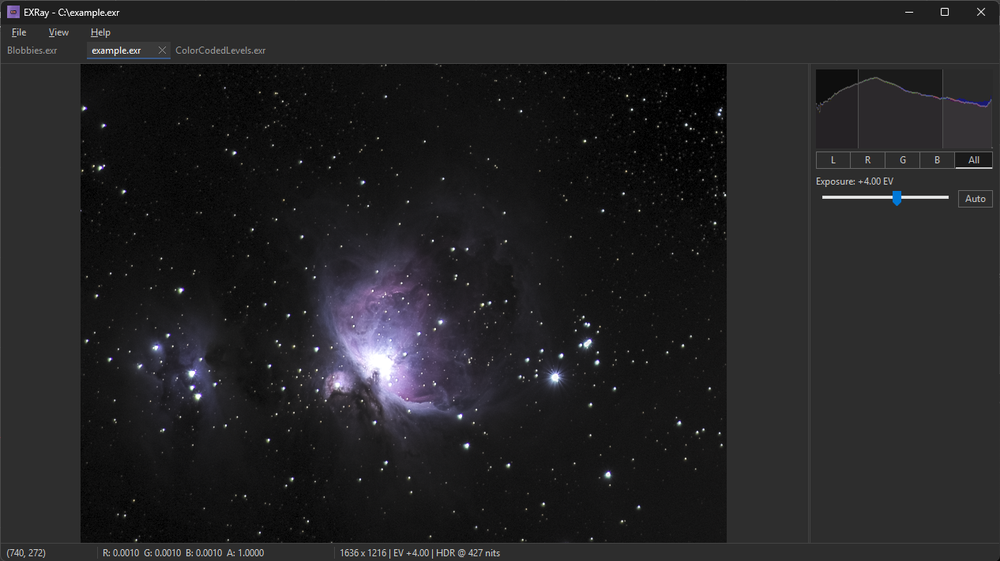

# EXRay

A fast, native, HDR-first EXR image viewer for Windows. Hardware-accelerated and built for people who just want to see their images.



## Features

- **Tiny footprint** - Fits on a floppy disk
- **Instant loading** - D3D11 hardware-accelerated rendering with background preload for adjacent tabs
- **HDR display support** - auto-detects HDR-capable monitors and outputs scRGB linear
- **Exposure & gamma control** - adjust EV stops and gamma with real-time controls
- **Sidebar** - layer browser, histogram, and exposure/gamma controls
- **Multi-layer & multi-channel** - browse EXR layers in a tree view, inspect individual channels
- **Histogram overlay** - per-channel histogram with luminance
- **Pixel inspector** - live RGBA readout under cursor in the status bar and right-click to copy
- **Pixel grid** - sub-pixel grid overlay that fades in at high zoom levels
- **Multi-image tabs** - open multiple EXR files, tab interactions to close
- **Dark & light themes** - follows your Windows appearance setting, DPI-aware
- **Drag and drop** - drop `.exr` files onto the window to open them
- **Fullscreen** - borderless fullscreen on the current monitor
- **Trackpad & touchscreen** - pinch-to-zoom, click-drag to pan, single-touch drag

## Supported EXR Features

| Feature | Support |
|---|---|
| Scanline images | Full |
| Tiled images | Full |
| All compressions (PIZ, ZIP, ZIPS, RLE, PXR24, B44, B44A, DWAA, DWAB, HTJ2K) | Full |
| Half-float (16-bit) pixels | Full (converted to 32-bit internally) |
| Float (32-bit) pixels | Full |
| Luminance/chroma (Y/C) images | Full (auto-converted to RGBA) |
| Data window offsets | Full |
| Multi-part images | First part only |
| Multi-view / stereo | Default view only |
| Deep images | Not supported |
| Integer pixel types | Not supported |
| Multi-resolution (mipmaps) | Full |
| Arbitrary channels (Z, normals, IDs) | Full (browse and inspect via sidebar) |
| Chromaticities / color profiles | Auto-converted to Rec. 709 (with Bradford adaptation) |

## Controls and Hotkeys

| Action | Input |
|---|---|
| Open file | `Ctrl+O` |
| Reload | `Ctrl+R` |
| Close tab | `Ctrl+W` |
| Next / previous tab | `Ctrl+Tab` / `Ctrl+Shift+Tab` |
| Fit to window | `Ctrl+0` |
| Actual size (1:1) | `Ctrl+1` |
| Zoom | Scroll · pinch (centered on cursor) |
| Pan | Click-drag · middle mouse drag · touch drag |
| Exposure ±0.25 EV | `Shift+Scroll` · horizontal scroll · `+` / `-` |
| Gamma ±0.05 (SDR) | `]` / `[` |
| Cycle histogram channel | `C` |
| Channel display mode | Shift plus: `~` RGB · `1` R · `2` G · `3` B · `4` A · `5` No-alpha |
| Toggle pixel grid | `G` |
| Toggle fullscreen | `F11` |
| Exit fullscreen | `Esc` |

## Installation

### Installable or portable versions

Download the latest installer or zip from [Releases](https://github.com/hughes/EXRay/releases).

### Build from source

EXRay uses [Bazel](https://bazel.build/) with MSVC on Windows.

```
git clone https://github.com/hughes/EXRay.git
cd EXRay
bazelisk build //:EXRay
```

The built binary is at `bazel-bin/EXRay.exe`.

#### Requirements

- **[Bazelisk](https://github.com/bazelbuild/bazelisk)** — the recommended Bazel launcher. Install via [WinGet](https://winget.run/): `winget install Bazel.Bazelisk`
- **MSVC** — Visual Studio 2019/2022 or Build Tools. When installing, make sure to include:
  - Workload: **"C++ build tools"** (or "Desktop development with C++") — this includes `cl.exe`, `link.exe`, etc. The default Build Tools install does *not* include the compiler.
  - Component: **Windows 10 SDK** (any recent version, e.g. 10.0.19041.0) — the SDK headers and libraries are required; the bin-only tools installed by some other packages are not sufficient.
- **Windows 10+**


## Privacy

EXRay does not collect, transmit, or store any user data. It includes no telemetry or analytics. The only network request EXRay makes is an optional update check against the GitHub Releases API (`api.github.com`) to notify you when a newer version is available. No personal or usage data is included in this request. In the event of a crash, a diagnostic minidump is saved locally to your `%TEMP%` directory — it is never sent anywhere automatically.

## License

EXRay is licensed under the [GNU General Public License v3.0](LICENSE).

Uses [OpenEXR](https://openexr.com/) (BSD-3-Clause) - see [THIRD_PARTY_LICENSES](THIRD_PARTY_LICENSES).

## Links

- [Changelog](CHANGELOG.md)
- [Code Signing Policy](CODE_SIGNING.md)
- [Matt Hughes](https://www.matthughes.info/)
